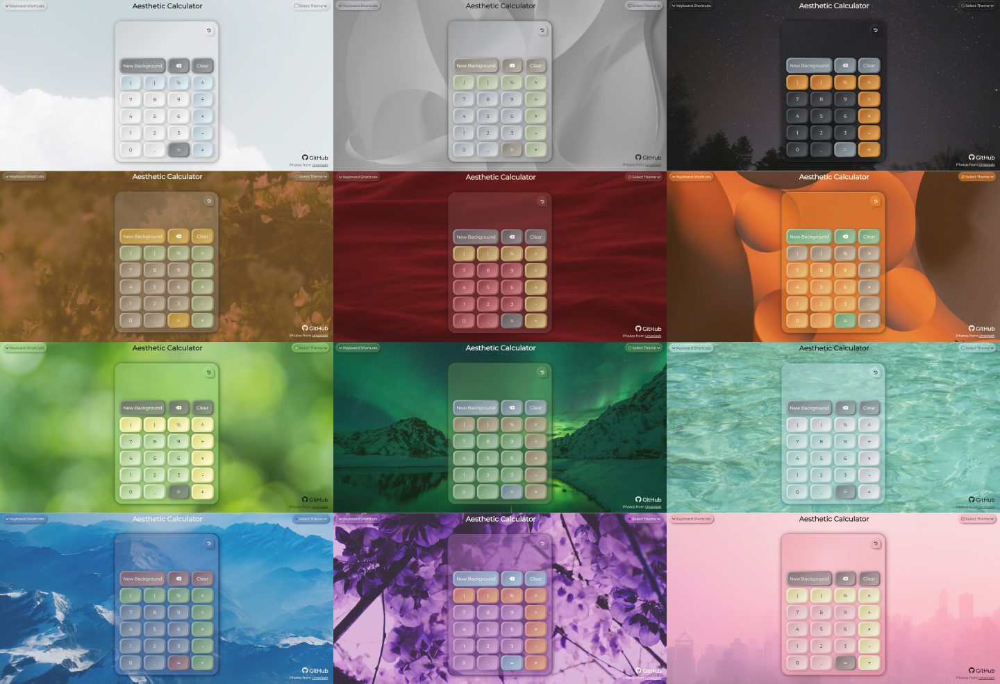
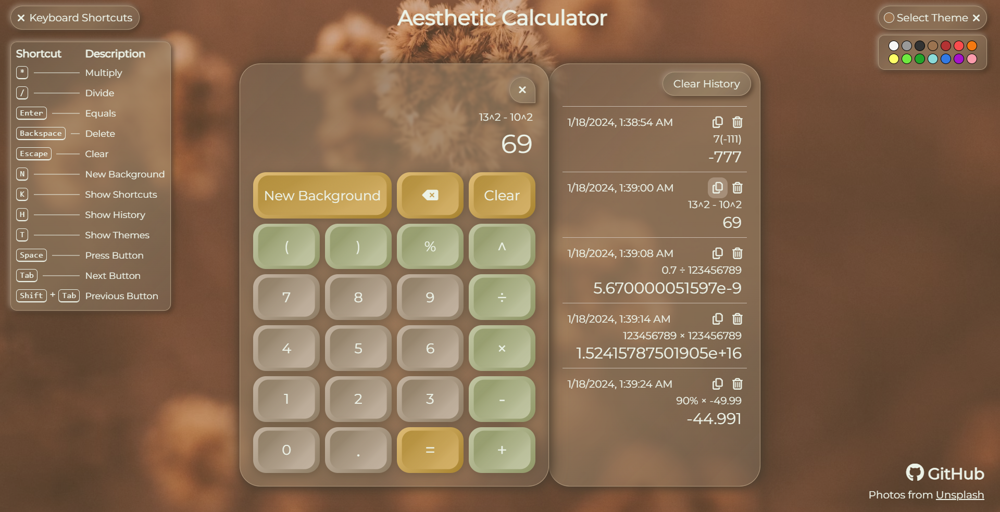

# [**Aesthetic Calculator**](https://kevster7000.github.io/Aesthetic-Calculator/)

***A calculator that supports PEMDAS with multiple themes, keyboard integration, and a history feature.***

This is my second web dev project, and it felt better than the first. Most of the time was spent styling and fixing little details, especially in picking the colors; I am a perfectionist after all. Though, the code got quite messy towards the end as I got burnt out. This was especially true as I was implementing the responsive designs since I saved those for last and didn't think much about them until then. Nonetheless, the vast majority of JavaScript was surprisingly fun to write and took me approximately 5 days, which is not bad at all in my standards. While I didn't learn too too much, this project gave me much more experience as well as confidence with these technologies. In the end, my skills definitely feel more solidified, and I created something much more than a toy project. I do believe that I am headed in the right direction with this, and I can't wait to do something new and start on my next projects.

## Purpose:

- This project really just served as practice with JavaScript and SASS and component-based building before I dive into TailwindCSS and React.  
- I felt like I didn't use too much JavaScript on my Weightlifting Website, and when I did, the code was pretty terrible in my opinion.  
- So, I thought, 'Sure, let's make a calculator,' but I didn't want to create something generic that looks like it was just copied from a tutorial.
- As a result, I made this thing which was a bit more complicated than expected and took much longer than desired, but it was well worth the practice.
- However, I am often more worried about the looks, design, and interface rather than the functionality, but it still works nonetheless.

## Features:

- PEMDAS, percent operator, and unary minus
- Precise decimal arithmetic thanks to [Big.js](https://mikemcl.github.io/big.js/)
- 14 unique themes
- Keyboard integration and shortcuts
- Calculation history
- Fully responsive
- Background images using [Unsplash](https://unsplash.com/)
- Aesthetic :sparkles:

## Reflections:

- I'm pretty satisfied with the final product; everything's cohesive and aesthetic and neumorphic and glassmorphic and whatnot. :art:
- Obviously, some themes could be better, but creating more color schemes just became tedious after the first 5.
- I'm proud of the fact that I wrote everything by myself. Though, I should probably look more into AI and Copilot, but that's something for much later. :shrug:
- Anywho, I'm quite happy about the history panel, especially how smooth it is on mobile.
- I am also exquisitely pleased with how I parsed the expression with regex and the calculation with stacks for infix/postfix shenanigans.
- The only unprecise calculation that can occur is with exponents that are not **small integers**: `-100000 < exp < 100000`.
- Not too proud of how I handled the conditions as the user types the expression; it works well though, and that's all that matters.
- But mainly, I'm pretty disappointed with my pace for this project; I really wanted to finish earlier. womp womp.
- Also, since I don't know how to use Node.js yet, I'm still using the web browser environment, meaning I couldn't use the Unsplash API even though I really wanted to. :slightly_frowning_face:
- One thing that I did learn inadvertently is that I need to think about responsive design during the process and not at the end. For this project, I designed the responsive layouts last without much forethought, and good golly did it make the code filthy. I could've made this much cleaner by planning ahead, but I most likely won't touch this code ever again, so rewriting what I had would just take more time. Plus, I was already very close to finishing.

> [!NOTE]
> The entire thing was tested by only one person which happens to be me, and I can only think of so much. 
> So if you find a way to break the thing, feel free to make a new issue. :thumbsup: 
> Though, I probably won't fix any issues, but it'll be cool to see how many little things I missed.

---

 
Hosted on [GitHub Pages](https://pages.github.com/)
